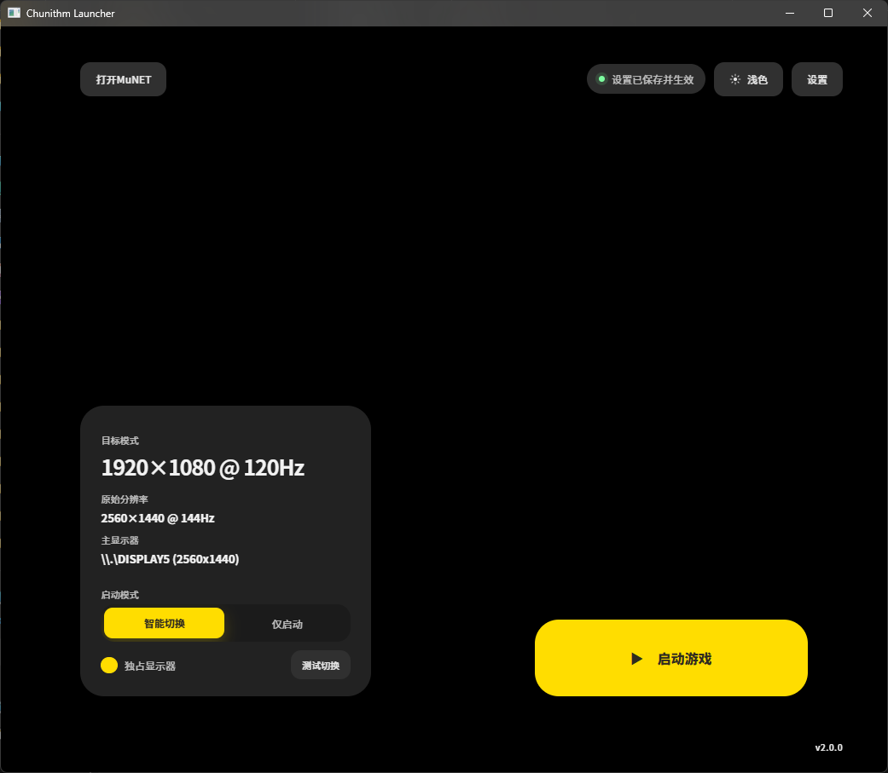
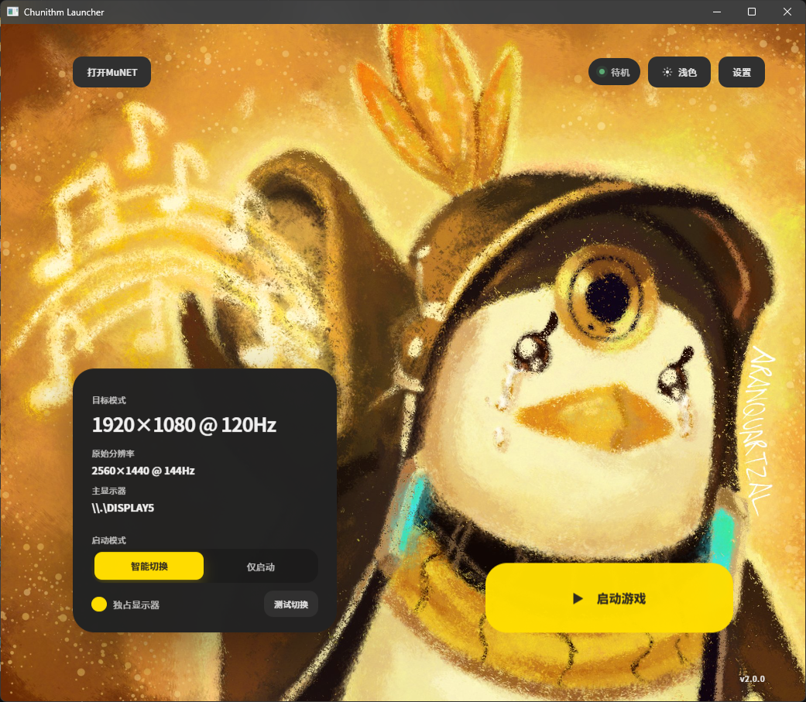

# CHUNITHM Launcher

基于 WebView2 的 CHUNITHM 快捷启动器：启动前切换分辨率，游戏关闭后恢复分辨率，并提供详细配置界面与主题化 UI。

## 项目声明

- 本项目为自由软件：你可以依据 GNU Affero General Public License v3（或任选后续版本）的条款重新分发或修改本项目

## 项目简介

由于《CHUNITHM》在 Windows 环境下通常以固定的 1080p 60Hz / 120Hz 进行渲染，现阶段 2K 高刷显示器已经相当普及，直接启动游戏时往往需要手动切换显示器分辨率，操作较为繁琐。

本项目旨在简化游戏启动前后的相关操作流程，提供更方便的启动体验。

## 免责声明

- 本项目仅为启动与显示设置辅助工具，不提供任何游戏资源。
- `CHUNITHM / チュウニズム` 相关名称、商标及其所属权利归 `SEGA` 所有。
- `中二节奏` 中文名称相关权利归 `华立科技` 与 `世嘉飞舞` 所有。
- 本项目仅面向 Windows 平台
- 本项目不包含任何绕过验证、破解或修改游戏程序本体的功能。
- 本项目与 `SEGA`、`华立科技`、`世嘉飞舞`、`MuNET`无任何从属、代理、合作或官方关联关系。

## 功能特性

- 启动游戏前自动切换目标分辨率
- 监测游戏窗口关闭后自动恢复原分辨率
- 首次配置向导与可视化设置界面
- 主题化 UI，支持背景图自定义
- 支持打开自定义ALL.Net提供者服务器

## 运行环境

为减小发布包体积，本项目不内置完整运行环境。首次运行前或运行时可能需要安装：

- `.NET Desktop Runtime 10 x64`
- `WebView2 Runtime`

如果电脑缺少上述运行环境，程序会弹窗提示，并引导打开官方下载页面。

## 使用方式

### 本地编译

使用Powershell运行`publish.ps1`，产物在`artifacts\publish`目录下

## 界面截图

### 默认背景

### 自定义背景

## 开源许可证

本项目采用 **GNU Affero General Public License v3.0 (AGPL-3.0)**。

- 你可以自由使用、复制、修改和分发本项目（含商业化使用），但需遵循 AGPL-3.0 条款
- 修改后的版本必须以 AGPL-3.0 发布，并提供相应的源代码
- 通过网络提供本项目的修改版本服务时，须向用户提供相应的源代码（AGPL 第 13 条）
- 本项目按“现状”提供，不附带任何明示或暗示担保（详见许可证第 15、16 条）

完整许可证文本见 [LICENSE](./LICENSE)。
